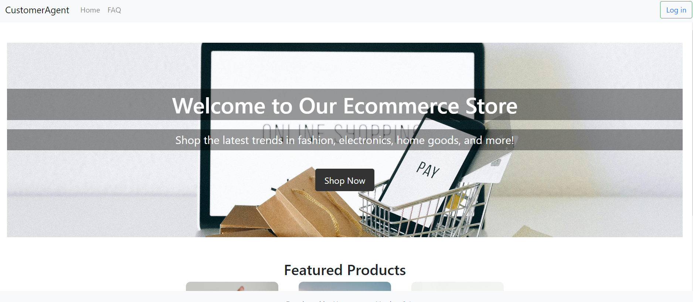

# customer support agent

## Problem_Statement:
Many businesses struggle to provide efficient and personalized customer support due to the huge number of inquiries. Manual handling of customer queries which can lead to delays in responses. A machine learning-powered customer support system can automate responses to common issues. In this project I am building an e-commerce website and integrate it with ML and LLM to solve this issue. 

## Proposed_Solution:
In the administrative part you will be able to see the sale’s prediction, new products classification bases on high and low demand, an AI agent powered by LLM to solve customer’s queries and etc. In the user panel also there will be a recommendation system to show them related products based on their previous purchase and a chatbot powered by LLM

#### The interface of the application will be something like this:

