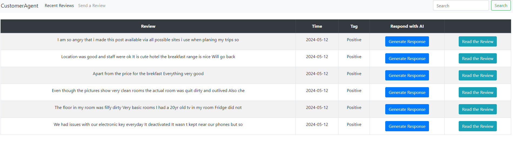

# Intelligent Customer Support System

## Problem Statement
Many businesses struggle to provide efficient and personalized customer support due to the sheer volume of inquiries. Manual handling of customer queries can lead to delays and inconsistencies in responses. A machine learning-powered customer support system can automate responses to common queries, prioritize urgent issues, and escalate complex queries to human agents.

## Proposed Solution
I decided to develop a Flask-based web application that serves as an intelligent customer support system. The system will integrate various machine learning models to classify and respond to customer reviews.

